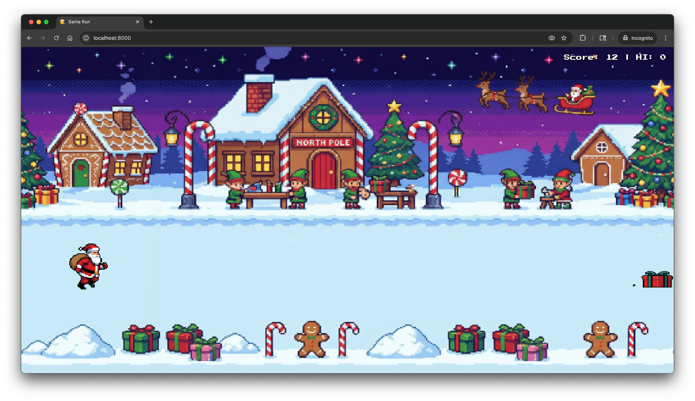

# 🎅 Santa Run

A festive infinite runner game featuring Santa Claus jumping over holiday-themed obstacles! Built with pure HTML5, CSS, and JavaScript.



## 🤖 Created with AI

This game was created using [**Antigravity**](https://antigravity.google) - Google's powerful agentic AI coding assistant. All game logic, animations, and styling were developed through AI-assisted pair programming.

The pixel art sprites and visual assets were generated using **Nano Banana Pro**.

## 🎮 How to Play

- **Objective**: Help Santa run as far as possible while avoiding holiday obstacles!
- **Controls**: 
  - Press `SPACE`, `CLICK`, or `TAP` to jump
  - Press `SPACE` to start the game
  - After game over, wait 0.5 seconds then press `SPACE` to restart
- **Scoring**: Your score increases automatically as you survive longer
- **High Scores**: Top 5 scores are saved locally - enter your name to claim your spot!

### Gameplay Tips
- Time your jumps carefully to clear obstacles
- The game speed increases over time - stay focused!
- Watch out for trees, presents, and stockings
- Beat your high score and challenge your friends!

## 🚀 Play the Game

### Option 1: Play Online (Recommended)
Visit the hosted version at: **[danistrebel.github.io/santa-run](https://danistrebel.github.io/santa-run)**

### Option 2: Run Locally
Clone this repository and start a local server:
```bash
python3 -m http.server
```
Then open your browser to `http://localhost:8000`

## 🎨 Features

- **Pixel Art Graphics**: Nostalgic 16-bit style visuals
- **Smooth Animations**: Running and jumping animations for Santa
- **Progressive Difficulty**: Game speed increases over time
- **Local High Scores**: Top 5 scores saved in browser localStorage
- **Responsive Design**: Scales to fit your screen
- **Holiday Theme**: Festive obstacles including trees, presents, and stockings
- **Background Parallax**: Scrolling winter wonderland background

## 🛠️ Technical Details

- **Pure Vanilla JavaScript**: No frameworks or dependencies
- **HTML5 Canvas**: Smooth 2D rendering
- **CSS3**: Modern styling with gradients and animations
- **LocalStorage**: Persistent high score tracking
- **Sprite Sheets**: Efficient 2x2 and 1x3 sprite animations
- **Collision Detection**: Precise hitbox with padding for fair gameplay

## 📁 Project Structure

```
santa-run/
├── index.html          # Main HTML file
├── style.css           # Game styling
├── script.js           # Game logic and mechanics
├── assets/
│   ├── santa.png       # Santa sprite sheet (2x2)
│   ├── obstacles.png   # Obstacle sprite sheet (1x3)
│   ├── background.png  # Scrolling background
│   └── screenshot.png  # Game screenshot
└── README.md           # This file
```

## 🎄 Game Mechanics

- **Gravity**: 0.6 pixels/frame²
- **Jump Force**: -12 pixels/frame
- **Initial Speed**: 5 pixels/frame
- **Max Speed**: 12 pixels/frame
- **Ground Height**: 100 pixels from bottom
- **Spawn Rate**: Obstacles spawn every 120 frames initially

## 📝 License

Created for fun and learning. Feel free to modify and share!

---

**Happy Holidays! 🎅🎄⛄**
